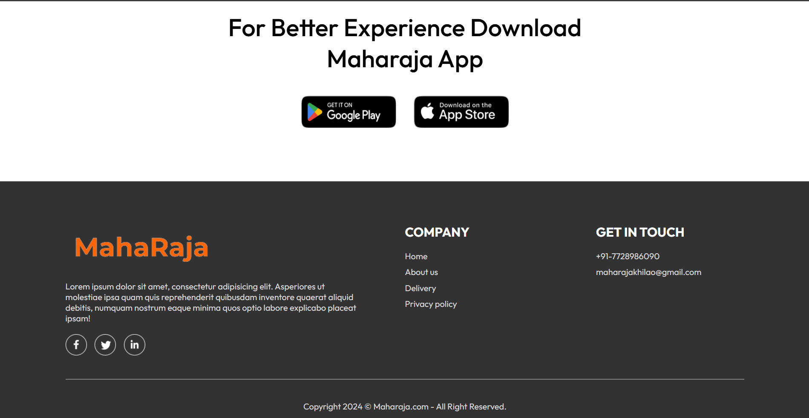
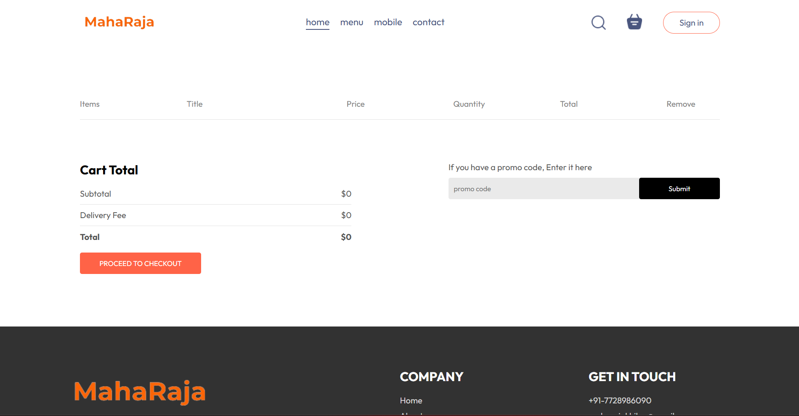
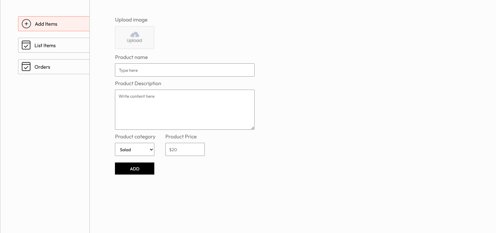

# 👑 Majharaja - Full Stack Food Delivery App

Majharaja is a complete full-stack food ordering web application built using the MERN stack (MongoDB, Express.js, React.js, Node.js) and Stripe for payments. It enables users to browse food items, add them to a cart, place orders, make secure online payments, and track their order status in real time through a smooth, responsive interface. The application also includes an admin panel for order management and viewing customer activities.

## Features

* **🔐 User Authentication:** Secure Signup and Login system using token-based authentication (JWT).
* **🍲 Food Browse:** Users can browse available food items with details.
* **🛒 Add to Cart:** Simple functionality to add desired food items to a shopping cart.
* **💳 Secure Payments:** Seamless checkout process integrated with Stripe API for handling payments securely.
* **📦 Order Placement:** Users can place their orders and receive instant confirmation.
* **⏱️ Live Order Status:** Real-time tracking of food orders from placement through various stages to delivery.
* **🧑‍🍳 Admin Panel:** A dedicated interface for administrators to manage incoming orders and monitor customer activities.
* **📡 Fully Connected Stack:** Responsive React frontend communicating with a robust Express.js backend connected to a MongoDB database.
* **📱 Responsive Design:** User interface designed to work well on various screen sizes.

## Screenshots


**Example:**

**Homepage / Food Listing:**



**Cart / Checkout:**



**Admin Panel:**



## Tech Stack

| Area       | Technology Used        |
| :--------- | :--------------------- |
| Frontend   | React.js, CSS          |
| Backend    | Node.js, Express.js    |
| Database   | MongoDB                |
| Auth       | JWT (JSON Web Tokens)  |
| Payment    | Stripe API             |
| State Mgmt | Context API (likely)   |

## Getting Started

### Prerequisites

* Node.js (Specify version, e.g., v18.x or later)
* npm or yarn
* MongoDB (Ensure you have a running instance - local or cloud-based like MongoDB Atlas)
* Stripe Account (To get API keys for payment processing)

### Installation

1.  **Clone the Repository:**
    ```bash
    git clone [https://github.com/sojashivam/majharaja.git](https://github.com/sojashivam/majharaja.git)
    cd majharaja
    ```

2.  **Setup Backend:**
    ```bash
    cd backend
    npm install
    # Configure backend environment variables (see below)
    ```

3.  **Setup Frontend:**
    ```bash
    cd ../frontend # Navigate back and into the frontend directory
    npm install
    # Configure frontend environment variables (see below)
    ```

### Running the App

1.  **Start the Backend Server:**
    ```bash
    cd backend
    npm start
    ```
    *(The backend server will typically run on a port like 4000 or specified in your environment variables)*

2.  **Start the Frontend Development Server:**
    ```bash
    cd ../frontend
    npm run dev
    ```
    *(The frontend app will typically run on http://localhost:5173 or another port)*

Open your browser and navigate to the frontend development server address.

## Environment Variables

Create separate `.env` files in the `backend` and `frontend` directories.

**Backend (`backend/.env`):**

```dotenv
# Server Configuration
PORT=5000 # Or any port you prefer for the backend

# Database Connection
MONGODB_URI="mongodb://localhost:27017/majharaja" # Replace with your MongoDB connection string (local or Atlas)

# JWT Authentication
JWT_SECRET="YOUR_SUPER_SECRET_KEY_FOR_JWT" # Replace with a strong, random secret

# Stripe API (Secret Key)
STRIPE_SECRET_KEY=sk_test_************************ # Replace with your Stripe Secret Key

# Frontend URL (For CORS)
FRONTEND_URL=http://localhost:3000 # Or the port your frontend runs on